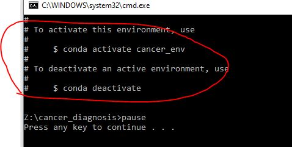
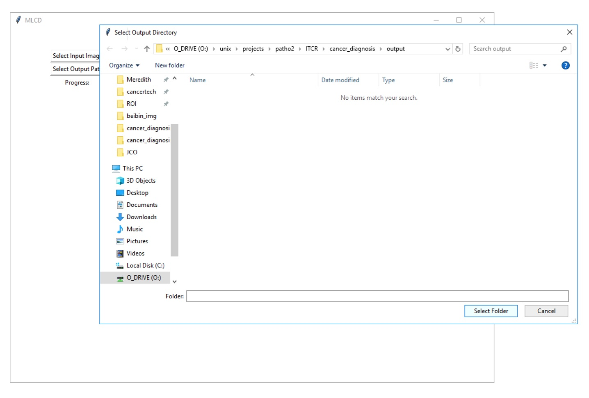
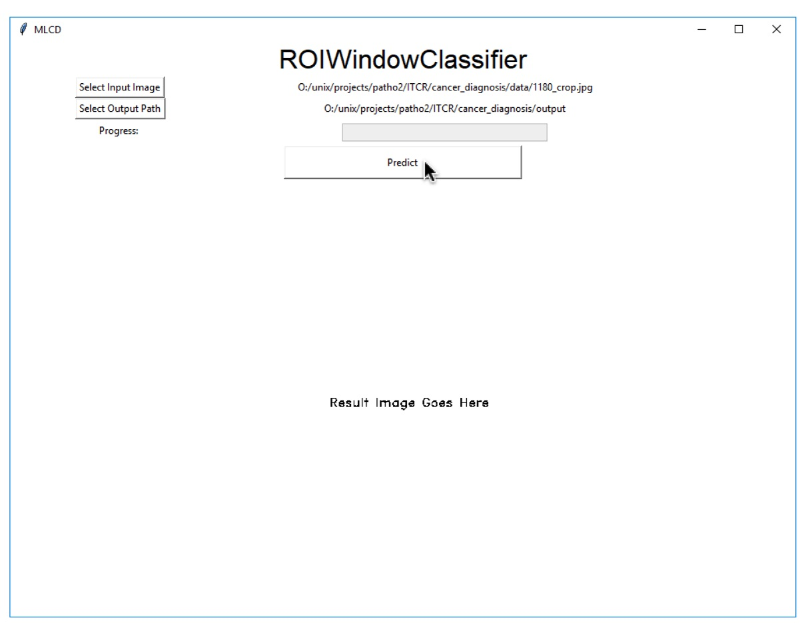

# A Unified Software Package for Cancer Diagnosis

This research is supported by the National Cancer Institute grant U01 CA231782, PI: Linda G. Shapiro, co-PI: Joann G. Elmore

The long-term goal of this project is to develop a unified software package for sharing image analysis and machine learning tools to improve the accuracy and efficiency of cancer diagnosis, thus aiding in improving the quality of both cancer research and clinical practice. Our specific aims are as follows: 1. Regions of Interest: Produce a ROI-finder classifier and associated tools for use by researchers or pathologists for automatic identification of potential ROIs on whole slide images of breast biopsy slides; 2. Diagnosis: Produce a diagnostic classifier and associated tools that can not only suggest the potential diagnosis of a whole slide image, but can also produce the reasons for the diagnosis in terms of regions on the image, their color, their texture, and their structure; 3. Dissemination: Develop a unified software package containing this suite of tools, so they can be easily shared and provided (standalone and through the existing Pathology Image Informatics Platform (PIIP)) to both cancer researchers and clinical pathologists. 

For more detail information, please visit <a href="http://cancertech.cs.washington.edu" target="_blank">our project website</a>.

# Installation

The installation instructions are shown in Windows operation system. The installation steps are similar for MacOS and Linux.

First, you can download our tools from 
<a href="https://github.com/meredith-wenjunwu/cancer_diagnosis" target="_blank">Github page</a> 
by clicking on the "Clone or download" button first and then clicking on the "Download ZIP" button.

   

## Files

Unzip `cancer_diagnosis-master.zip`, you will see the following folders:

- YNet: source code for <a href="https://arxiv.org/abs/1806.01313" target="_blank">YNet</a> 
- data: contains a sample test image
- models: contains pre-trained models
- output: output files for all modules (contains pre-computed features for sample image)
- utils: other supporting source code

Note that the unzipped folder can either be named as "cancer_diagnosis" or "cancer_diagnosis-master", which will not affect how the program runs.

## Install Anaconda

You need to install Python and dependencies required to run the provided package. We use Anaconda to manage Python dependencies, and you can download the latest version of Anaconda with Python 3.6 or 3.7 from 
<a href="https://www.anaconda.com/distribution/" target="_blank">here</a> .

You should follow the instructions as shown in the screenshots below. Pay attention to the buttons marked with red ink.
Installing Anaconda for all users to the "C:/ProgramData/Anaconda3/" path can make the program running smoothly.

<!--  	 -->

# Install Dependencies

After installing Anaconda, you can install all the required packages by double clicking on the `0_install_dependencies.bat` file, as shown below.

The installation may take around 10-20 minutes. After installation, you can proceed to tutorial.

If you see a "Windows protected your PC" window as below. You can first click on the "More Info" button and then "Run anyway" button to allow our program to run. 

When the installation is done, you can see a similar message as shown below.

  

## (Optional) Install CUDA for Nvidia GPU Only

In the semantic segmentation part, we will use Convolutional Neural Networks to analyze the input ROI images, and this slow process can be accelerated by using Nvidia GPUs.
If you have an Nvidia GPU in your computer, you can 
<a href="https://developer.nvidia.com/cuda-downloads" target="_blank">download</a>
and install CUDA 10.2 before running our programs.

Note, you should download and install this tool first before reading this tutorial. You can follow the 
<a href="https://cancertech.cs.washington.edu/installation.html" target="_blank">installation page</a> 
 for instructions.

# Step 1: Get ROI from Whole Slide Image
This is an example of how to use ROIWindowClassifier to detect diagnostically relevant regions of interest in breast biopsy whole slide images.  

Double click the `1_ROI.bat` file, as shown below.

Then, you will see the following interface where you can provide the path to a pretrained model, breast biopsy image and output directory.

First, click on "Select Input Image" to select the image you want to identify regions-of-interest from (default is `cancer_diagnosis-master/data/1180_crop.jpg`). You can select one image at a time (supported format is the same as [opencv](https://docs.opencv.org/3.4/d4/da8/group__imgcodecs.html#ga288b8b3da0892bd651fce07b3bbd3a56)) . Note: This demo is only designed to handle images with a size of fewer than 2^64 pixels. 

Next, click on "Select Output Path" to select where you want the output files to be saved. The default is `cancer_diagnosis-master/output`. Use "Select Folder" button to confirm the selection. 

Last, click on "Predict" to start the ROI detection process. Please see below for expected outcome. 

### Example for ROI Identification

Here, we show the results for a cropped whole-slide image (`1180_crop.jpg`). 

The ROIWIndowClassifier can finish processing this provided sample from scratch in about 20 minutes depending on the memory and CPU capacity. To speed up the testing process, the pre-computed feature file `1180_crop_feat.pkl` is included in the package. The progress bar in the interface also shows the progress of feature computation.

In the end, the main window would display the ROI identification results where the regions-of-interest are marked in red boxes.

##### Output Files

In the end, the following files will be generated in the output folder provided, which can later be used for ROI segmentation and diagnosis prediction. 

The files are:

- **<u>`1180_crop_0.jpg`</u>**: the resultant ROI image (input to ROI Segmentation)
- 1180_crop_marked.jpg: regions-of-interest visualization with identified regions marked in red boxes

# Step 2: ROI Segmentations
After you have the resultant ROI image from Step 1, we can now move to ROI segmentations. The following figures illustrate how to use this tool to get segmentation for ROIs. The segmentation results will be used as features for diagnosis prediction. 

Double click the `2_Semantic_Segmentation.bat` file, as shown below.

Then you will see the following interface where you can select the model, ROI image, and output directory.

  

You should choose one or more ROI images at a time as shown below. Hold the "Control" key if you want to select multiple files, which is the standard multi-file selection in Windows OS. 
In this example, you can select the "1180_crop_0.jpg" image.

Similarly, you can choose the desired output folder by clicking the "Select Output Directory" button and choose a folder.

  

You can also change the parameter for "Batch Size" by using the slider, where the batch size is a term used in machine learning and refers to the number of samples processed in one iteration. When the computer has lots of memory or a large GPU, you can use a larger batch size. Usually, large batch size can make the CNN runs faster, but a large batch size would require lots of memory. We recommend to you the default setting unless your computer memory is too low or too high. If you saw any kind of memory error printed by the GUI, then restart the process with smaller batch size.

At last, click on the "Begin Segmentation" button to process these ROI images. Depends on your computer hardware (memory, GPU, etc) and the size of ROI, it usually takes 2 to 20 minutes to process each ROI on a GPU. 
CPUs are usually more than 10x slower than GPUs for deep learning, and we do not recommend users to use CPU for this step (i.e. ROI segmentation).

<!--
If the ROI contains more than 1 billion pixels, then it might take over an hour to process the ROI without GPU acceleration. Note that an 8GB GPU usually runs 10x faster than an i7 CPU.
-->

The 8 semantic segmentation classes  are:

<!--
1. Backgrounds 
2. Benign Epithelium
3. malignant Epithelium
4. Normal Stroma
5. Desmoplastic Stroma
6. Secretion
7. Blood
8. Necrosis
-->

  

## Examples for ROI Segmentation
Here, we show the results for the detected ROI from the first step. 

### Input ROIs
This ROI is chosen by the "Select Images".

### Output Files
The CNN can finish processing these two ROIs after a 1-hour process on CPU or 10-minute process on GPU (Nvidia GTX 1080 Ti). Note that there are over 0.8 billion pixels in these two ROIs.
The following files are generated in the output folder, which can be used for visualization and diagnosis prediction.

The files are:

* `_seg_label.png` (segmentation label), where the masks are stored.
* `_seg_viz.png` (segmentation visualization)
* `csv` (features for all tiles) files.

### Visualize Segmentation Mask
Here we show the segmentation visualization images. 

A sample of the CSV file is shown below, which has thousands of rows and columns that will be used as features for the machine learning algorithm for diagnosis prediction.

# Step 3: Diagnosis based on Segmentation Results
The ROI finder (in Step 1 above) usually selects more than one ROI for each subject, because there are often several interesting locations for analysis. The diagnosis prediction is given for each ROI, and the final diagnosis prediction for the subject is the maximum of diagnosis of all ROIs.

Double click the `3_Diagnosis.bat` file, as shown below.

Then you will see the following interface, where you can select the CSV files generated from the previous step (i.e. ROI segmentation).
Similar to the previous step, you should select all CSV files in the same window by holding the "Control" key.

  

Then, you can click on the "Begin Classification" button, and the program will produce the result in another window.
Note that this step is super fast, which takes less than 10 seconds for each CSV file.

  

Here, the red font shows the prediction for the input CSV files.
Again, we will choose the largest value (worst diagnosis prediction) as the final prediction for the subject if multiple ROIs are extracted from Step 1.

  

# User Support

If you have any questions, you can visit the 
<a href="https://github.com/meredith-wenjunwu/cancer_diagnosis/issues" target="_blank">Github issue page</a> 
and submit an issue via the "New issue" button as shown below.

  

