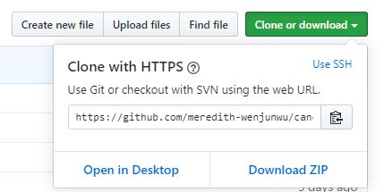
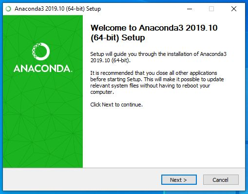
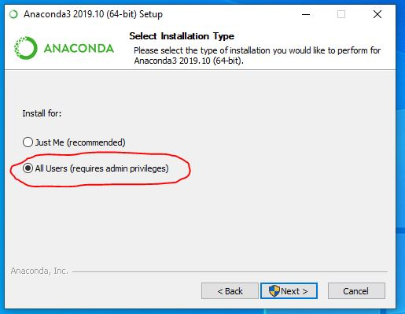
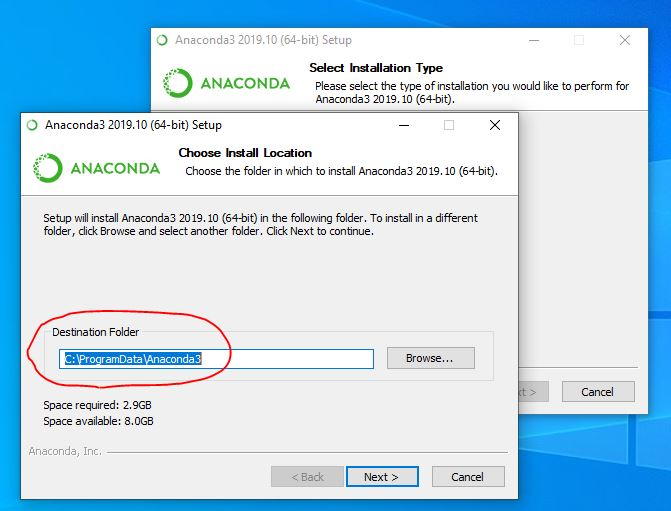
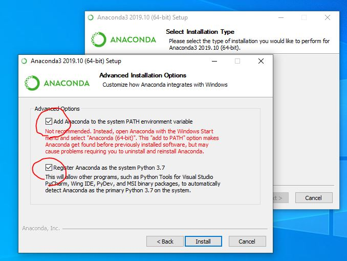
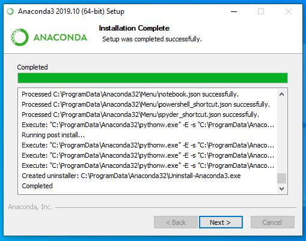
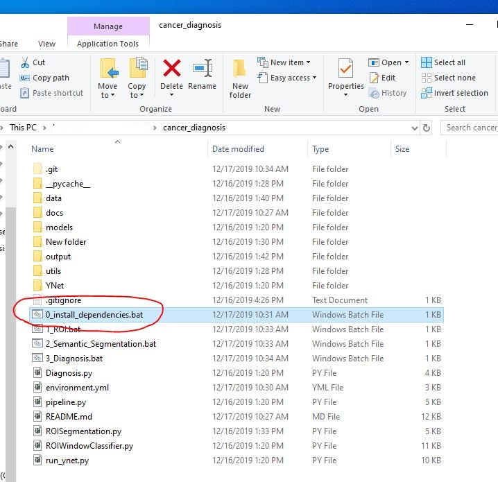
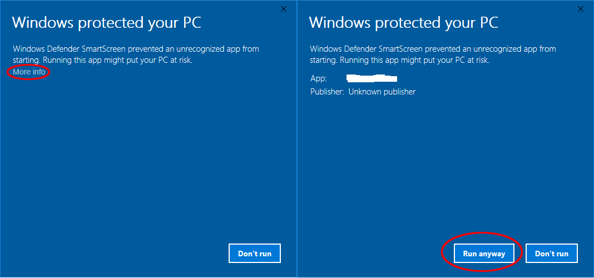

# Installation

The installation instructions are shown in Windows operation system. The installation steps are similar for MacOS and Linux.

First, you can download our tools from 
<a href="https://github.com/meredith-wenjunwu/cancer_diagnosis" target="_blank">Github page</a> 
by clicking on the "Clone or download" button first and then clicking on the "Download ZIP" button.

   

## Files

Unzip `cancer_diagnosis-master.zip`, you will see the following folders:

- YNet: source code for <a href="https://arxiv.org/abs/1806.01313" target="_blank">YNet</a> 
- data: contains a sample test image
- models: contains pre-trained models
- output: output files for all modules (contains pre-computed features for sample image)
- utils: other supporting source code

Note that the unzipped folder can either be named as "cancer_diagnosis" or "cancer_diagnosis-master", which will not affect how the program runs.

## Install Anaconda

You need to install Python and dependencies required to run the provided package. We use Anaconda to manage Python dependencies, and you can download the latest version of Anaconda with Python 3.6 or 3.7 from 
<a href="https://www.anaconda.com/distribution/" target="_blank">here</a> .

You should follow the instructions as shown in the screenshots below. Pay attention to the buttons marked with red ink.
Installing Anaconda for all users to the "C:/ProgramData/Anaconda3/" path can make the program running smoothly.

<!--  	 -->

# Install Dependencies

After installing Anaconda, you can install all the required packages by double clicking on the `0_install_dependencies.bat` file, as shown below.

The installation may take around 10-20 minutes. After installation, you can proceed to tutorial.

If you see a "Windows protected your PC" window as below. You can first click on the "More Info" button and then "Run anyway" button to allow our program to run. 

  

## (Optional) Install CUDA for Nvidia GPU Only

In the semantic segmentation part, we will use Convolutional Neural Networks to analyze the input ROI images, and this slow process can be accelerated by using Nvidia GPUs.
If you have an Nvidia GPU in your computer, you can 
<a href="https://developer.nvidia.com/cuda-downloads" target="_blank">download</a>
and install CUDA 10.2 before running our programs.

