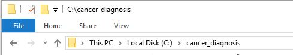
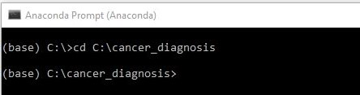
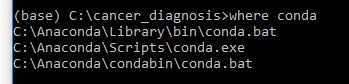

# Installation

First, you can download our tools from [Github page](https://github.com/meredith-wenjunwu/cancer_diagnosis) by clicking on the "Clone or download" button first and then clicking on the "Download ZIP" button.


<br><br> 

## Files

Unzip `cancer_diagnosis-master.zip`, you will see the following folders:

- YNet: source code for [YNet](https://arxiv.org/abs/1806.01313)
- data: contains a sample test image
- models: contains pre-trained models
- output: output files for all modules (contains pre-computed features for sample image)
- utils: other supporting source code

## Install Anaconda

You need to install Python and dependencies required to run the provided package. We use Anaconda to manage Python dependencies, and you can download the latest version of Anaconda with Python 3.6 or 3.7 from [here](https://www.anaconda.com/distribution/).

You should follow the instructions as shown in the screenshots below. Pay attention to the buttons marked with red ink.
Installing Anaconda for all users to the "C:/ProgramData/Anaconda3/" path can make the program running smoothly.

<!--  	 -->


After installing Anaconda, you can install all the required packages by opening Anaconda Prompt. 

First, navigate to the folder of `cancer_diagnosis` . 

 	

<br> <br>



Then, find out the installation path of Anaconda using the command `where conda` in Anaconda Prompt. 





Open `environment.yml` in `cancer_diagnosis`. Scroll to the last line. Make sure the path to Anaconda (in the above example `C:\Anaconda` ) is the right prefix. Otherwise, replace the last line in the following format: 

```visual basic
prefix: [path_to_anaconda]\envs\cancer_env
```

Now, copy the following command into Anaconda Prompt:

```bash
conda env create -f environment.yml
```

The installation may take around 10-20 minutes. After installation, you can proceed to Step 1. 

<br><br>

## Install Cuda (Optional)

In the semantic segmentation part, we will use Convolutional Neural Networks to analyze the input ROI images, and this slow process can be accelerated by using Nvidia GPUs.
If you have an Nvidia GPU in your computer, you can [download](https://developer.nvidia.com/cuda-downloads) and install CUDA 10.2 before running our programs.


