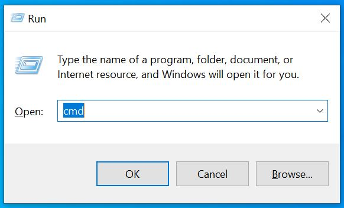
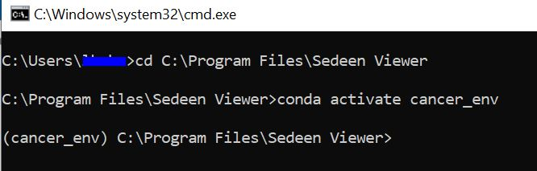
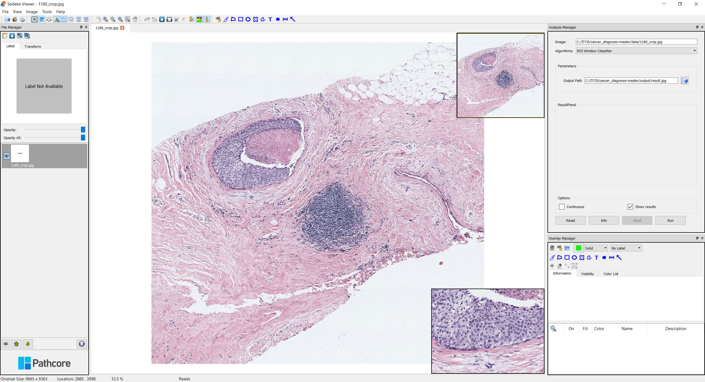
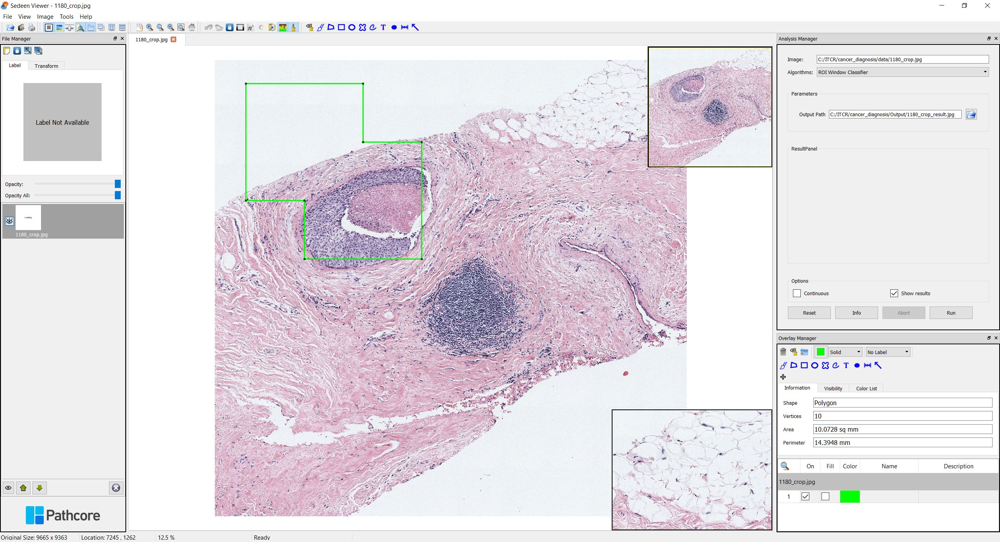
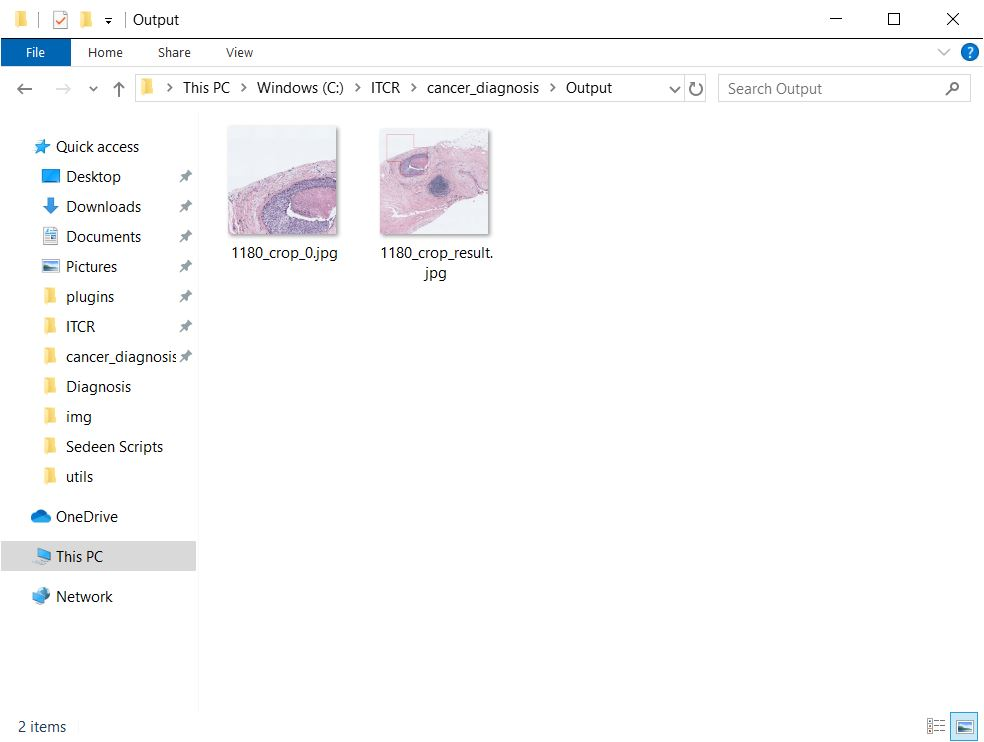

## **Tutorial**

### **Open Sedeen Viewer**
To use our plugins in `Sedeen Viewer`, you need to launch Sedeen in the conda environment `cancer_env`. **To make sure the plugins are running successfully, it's highly recommended that you launch a new `Sedeen Viewer` everytime you run a plugin.**

1. Launch command lines with *Win+R*, open **cmd**.



2. Change directory to where Sedeen Viewer is installed by

```
cd C:\Program Files\Sedeen Viewer
```

Note that the directory could change, depending on where you install it.

3. Switch to the environment by

```
conda activate cancer_env
```


4. Open Sedeen Viewer with

```
sedeen.exe
```

### **ROI Window Classifier**

1. Open the image you want to process with File->Open.


2. Select `ROI Window Classifier` from the algorithm option box in `Analysis Manager` window. If the window is not showing, you can go to View->Windows->Analysis Manager to get it displayed.

3. Choose an output path from the `Output Path` box.



4. Click `Run` and select [Sedeen_ROIWindowClassifier.py](<./Sedeen Scripts/Sedeen_ROIWindowClassifier.py>)


5. If it's the first time you run this image, it may take more than 10 minutes, depending on the memory and CPU capacity.


After running the program, Sedeen Viewer would display the ROI identification results where the regions-of-interest are marked in green boxes.



The following files will be generated in the selected folder, which can later be used for ROI segmentation and diagnosis prediction.



### **ROI Segmentation**

1. Open an image in Sedeen Viewer and select `ROI Semantic Segmentation` from the algorithm option box. The image could be random as it's only for enabling the algorithm part.

2. Select one or more ROI images. Hold the "Control" key if you want to select multiple files, which is the standard multi-file selection in Windows OS. 
    
    You can also change the parameter for "Batch Size" by using the slider, where the batch size is a term used in machine learning and refers to the number of samples processed in one iteration. When the computer has lots of memory or a large GPU, you can use a larger batch size. Usually, large batch size can make the CNN runs faster, but a large batch size would require lots of memory. We recommend to you the default setting unless your computer memory is too low or too high. If you saw any kind of memory error printed by the GUI, then restart the process with smaller batch size.

3. Click `Run` and select [Sedeen_ROISegmentation.py](<./Sedeen Scripts/Sedeen_ROISegmentation.py>).

    Depends on your computer hardware (memory, GPU, etc) and the size of ROI, it usually takes 2 to 20 minutes to process each ROI on a GPU. CPUs are usually more than 10x slower than GPUs for deep learning, and we do not recommend users to use CPU for this step (i.e. ROI segmentation).

    The 8 semantic segmentation classes are:

    

4. After running the program, a result panel will pop up, showing the segmentation results and the results in superpixels. You can click "Previous" or "Next" to view the corresponding segmentations of the selected images.

### **Diagnosis**

1. Open an image in Sedeen Viewer and select `ROI Diagnosis` from the algorithm option box. The image could be random as it's only for enabling the algorithm part.

2. Select the CSV files generated from the previous step (i.e. ROI Segmentation).

3. Click `Run` and select [Diagnosis.py](<./Sedeen Scripts/Sedeen_Diagnosis.py>).

    Note that this step is super fast, and you should see the the diagnosis prediction in the result panel in a short time.


## **User Support**
If you have any questions, you can visit the [Github issue page]https://github.com/cancertech/cancer_diagnosis/issues) and submit an issue via the "New issue" button shown below.


