Note, you should download and install this tool first before reading this tutorial. You can follow the 
<a href="https://cancertech.cs.washington.edu/installation.html" target="_blank">installation page</a> 
 for instructions.

# Step 1: Get ROI from Whole Slide Image
This is an example of how to use ROIWindowClassifier to detect diagnostically relevant regions of interest in breast biopsy whole slide images.  

Double click the `1_ROI.bat` file, as shown below.

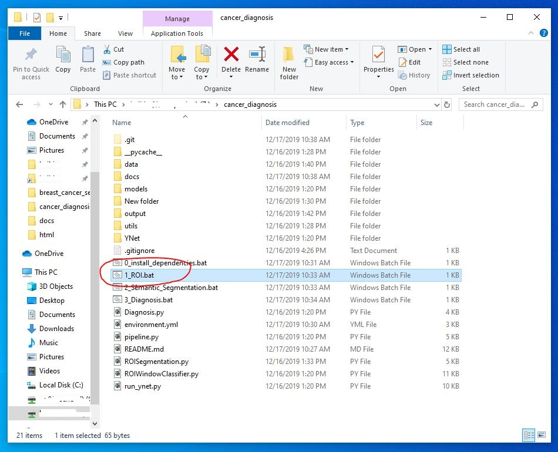

Then, you will see the following interface where you can provide the path to a pretrained model, breast biopsy image and output directory.

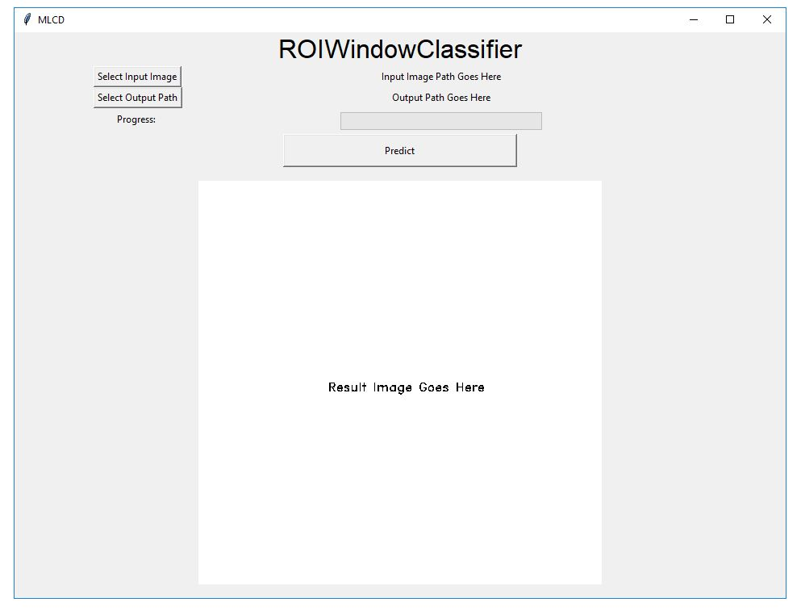

 First, Click on "Select Pre-trained Model Path" to select `cancer_diagnosis/models`, which contains `kmeans.pkl`,  `hcluster.pkl` and `clf.pkl`. Then, Click on "Select Input Image" to select the image you want to identify regions-of-interest from (default is `cancer_diagnosis/data/1180_crop.jpg`). You can select one image at a time. Note: This demo is only designed to handle images with a size of fewer than 2^64 pixels. 

### Example for ROI Identification

Here, we show the results for a cropped whole-slide image (`1180_crop.jpg`). 

The ROIWIndowClassifier can finish processing this provided sample from scratch in about 20 minutes depending on the memory and CPU capacity. To speed up the testing process, the pre-computed feature file `1180_crop_feat.pkl` is included in the package. The progress bar in the interface also shows the progress of feature computation.

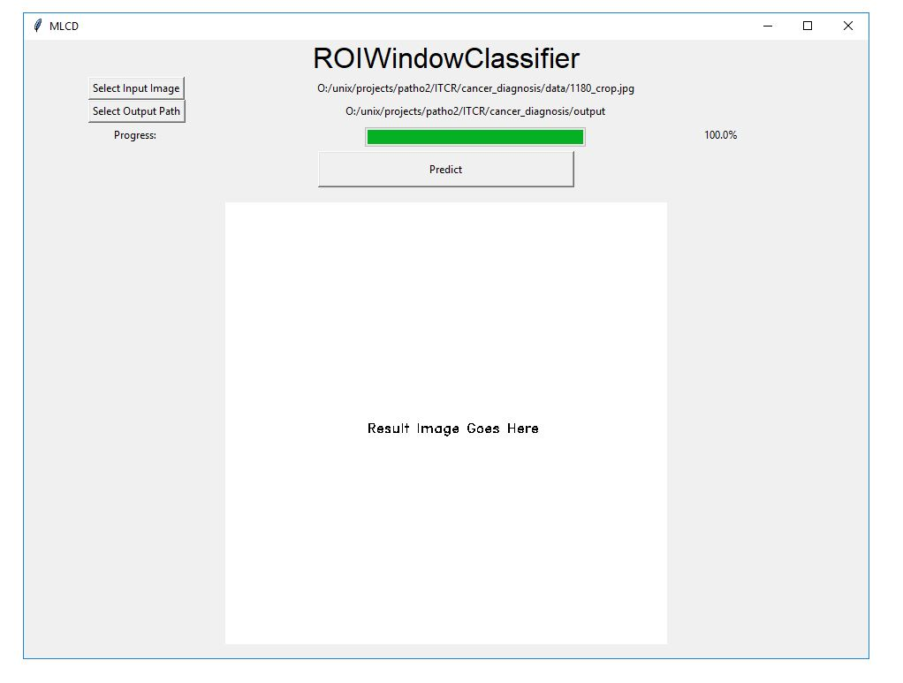

In the end, the main window would display the ROI identification results where the regions-of-interest are marked in red boxes.

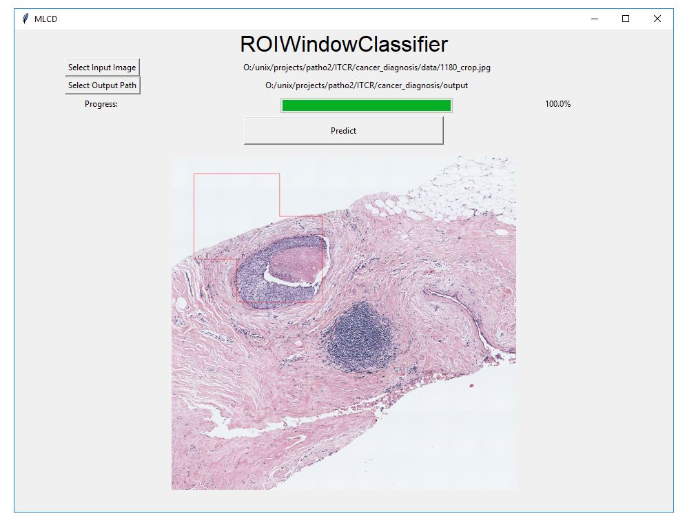

##### Output Files

In the end, the following files will be generated in the output folder provided, which can later be used for ROI segmentation and diagnosis prediction. 

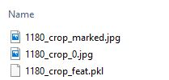

The files are:

- **<u>`1180_crop_0.jpg`</u>**: the resultant ROI image (input to ROI Segmentation)
- 1180_crop_marked.jpg: regions-of-interest visualization with identified regions marked in red boxes

# Step 2: ROI Segmentations
After you have the resultant ROI image from Step 1, we can now move to ROI segmentations. The following figures illustrate how to use this tool to get segmentation for ROIs. The segmentation results will be used as features for diagnosis prediction. 

Double click the `2_Semantic_Segmentation.bat` file, as shown below.

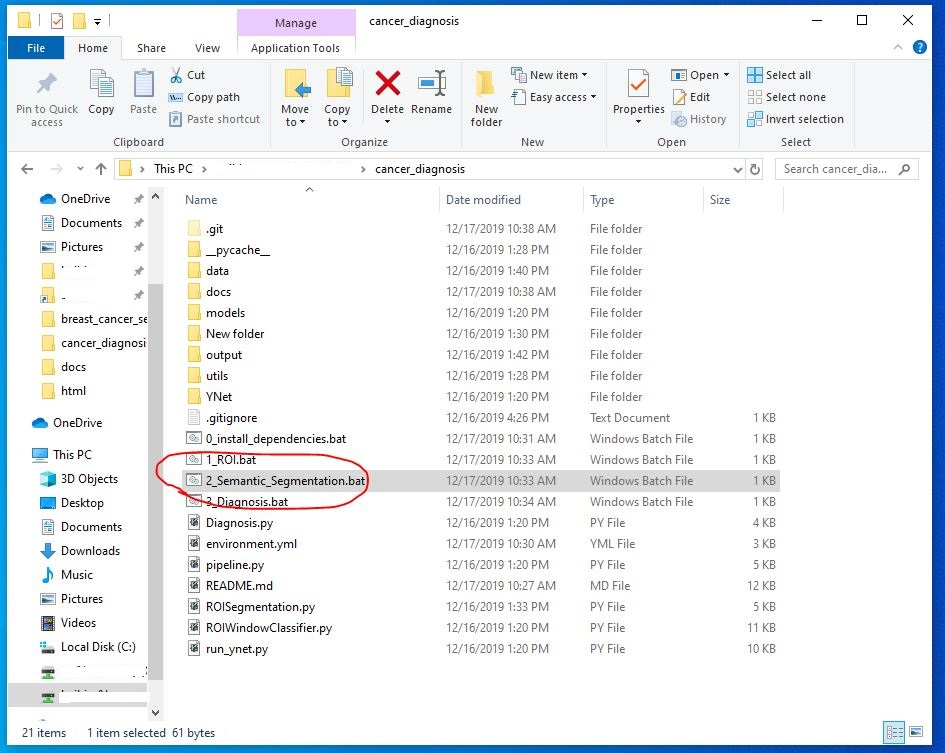

Then you will see the following interface where you can select the model, ROI image, and output directory.

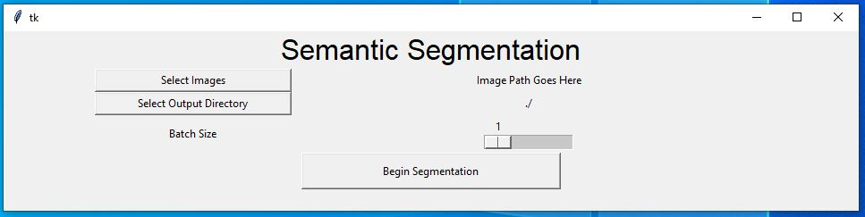
  

You should choose one or more ROI images at a time as shown below. Hold the "Control" key if you want to select multiple files, which is the standard multi-file selection in Windows OS. 
In this example, you can select the "1180_crop_0.jpg" image.

Similarly, you can choose the desired output folder by clicking the "Select Output Directory" button and choose a folder.

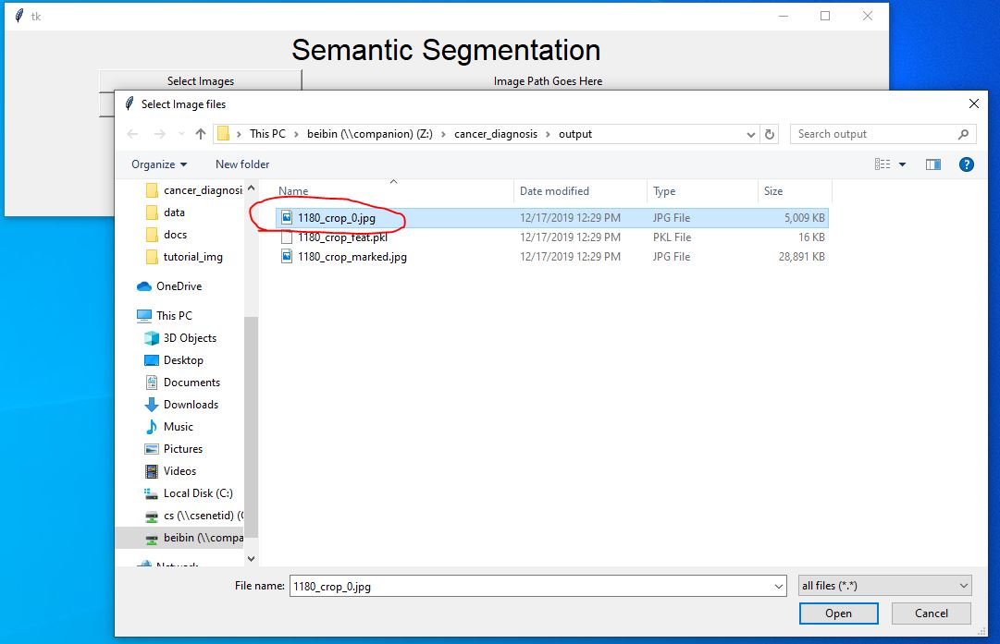
  

You can also change the parameter for "Batch Size" by using the slider, where the batch size is a term used in machine learning and refers to the number of samples processed in one iteration. When the computer has lots of memory or a large GPU, you can use a larger batch size. Usually, large batch size can make the CNN runs faster, but a large batch size would require lots of memory. We recommend to you the default setting unless your computer memory is too low or too high. If you saw any kind of memory error printed by the GUI, then restart the process with smaller batch size.

At last, click on the "Begin Segmentation" button to process these ROI images. Depends on your computer hardware (memory, GPU, etc) and the size of ROI, it usually takes 2 to 20 minutes to process each ROI on a GPU. 
CPUs are usually more than 10x slower than GPUs for deep learning, and we do not recommend users to use CPU for this step (i.e. ROI segmentation).

<!--
If the ROI contains more than 1 billion pixels, then it might take over an hour to process the ROI without GPU acceleration. Note that an 8GB GPU usually runs 10x faster than an i7 CPU.
-->

The 8 semantic segmentation classes  are:

<!--
1. Backgrounds 
2. Benign Epithelium
3. malignant Epithelium
4. Normal Stroma
5. Desmoplastic Stroma
6. Secretion
7. Blood
8. Necrosis
-->

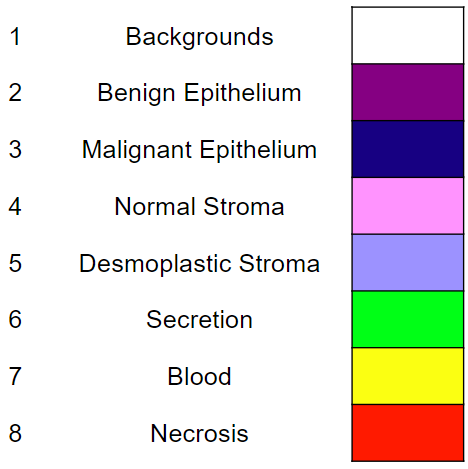
  

## Examples for ROI Segmentation
Here, we show the results for the detected ROI from the first step. 

### Input ROIs
This ROI is chosen by the "Select Images".

### Output Files
The CNN can finish processing these two ROIs after a 1-hour process on CPU or 10-minute process on GPU (Nvidia GTX 1080 Ti). Note that there are over 0.8 billion pixels in these two ROIs.
The following files are generated in the output folder, which can be used for visualization and diagnosis prediction.

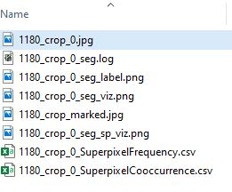

The files are:

* `_seg_label.png` (segmentation label), where the masks are stored.
* `_seg_viz.png` (segmentation visualization)
* `csv` (features for all tiles) files.

### Visualize Segmentation Mask
Here we show the segmentation visualization images. 

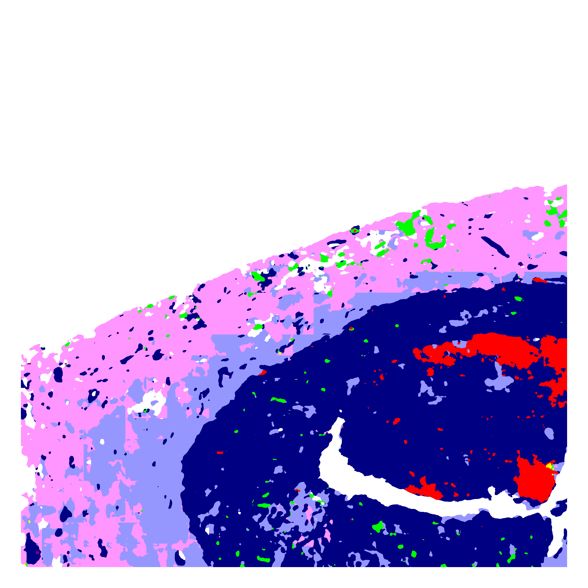

A sample of the CSV file is shown below, which has thousands of rows and columns that will be used as features for the machine learning algorithm for diagnosis prediction.
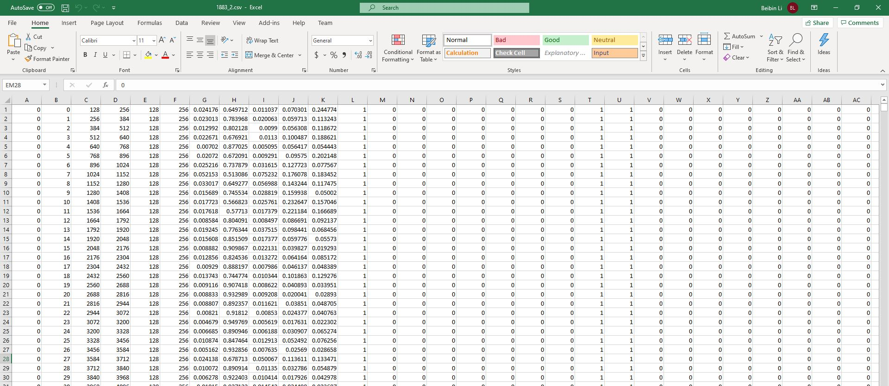

# Step 3: Diagnosis based on Segmentation Results
The ROI finder (in Step 1 above) usually selects more than one ROI for each subject, because there are often several interesting locations for analysis. The diagnosis prediction is given for each ROI, and the final diagnosis prediction for the subject is the maximum of diagnosis of all ROIs.

Double click the `3_Diagnosis.bat` file, as shown below.
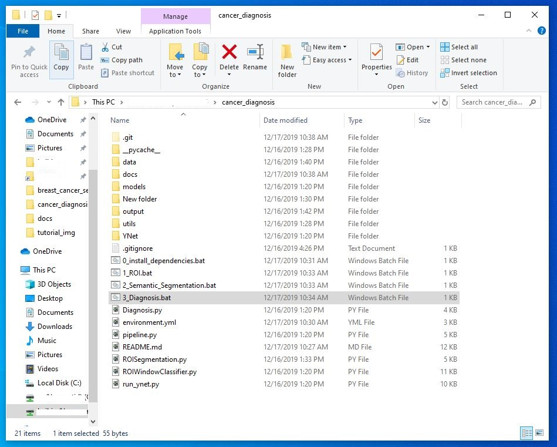

Then you will see the following interface, where you can select the CSV files generated from the previous step (i.e. ROI segmentation).
Similar to the previous step, you should select all CSV files in the same window by holding the "Control" key.

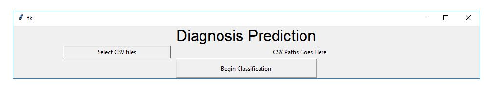
  

Then, you can click on the "Begin Classification" button, and the program will produce the result in another window.
Note that this step is super fast, which takes less than 10 seconds for each CSV file.

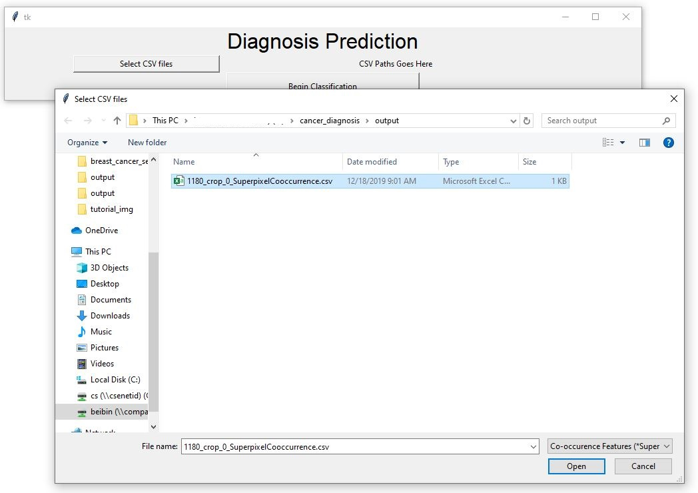
  

Here, the red font shows the prediction for the input CSV files.
Again, we will choose the largest value (worst diagnosis prediction) as the final prediction for the subject if multiple ROIs are extracted from Step 1.

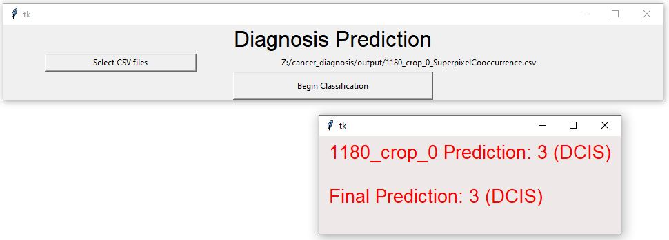
  

# User Support

If you have any questions, you can visit the 
<a href="https://github.com/meredith-wenjunwu/cancer_diagnosis/issues" target="_blank">Github issue page</a> 
and submit an issue via the "New issue" button as shown below.

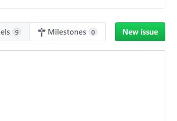
  
