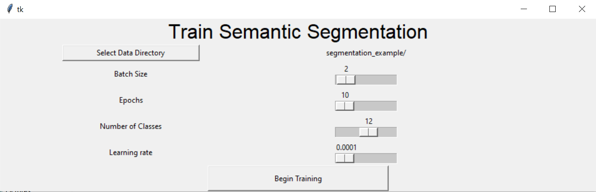
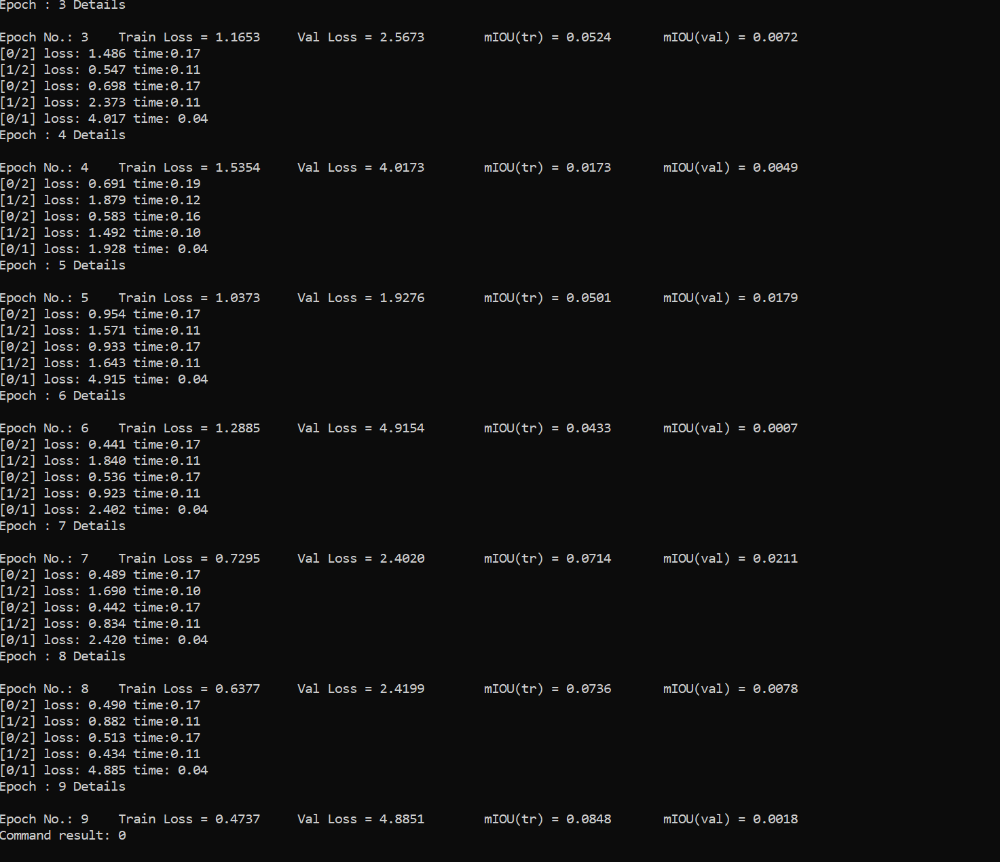
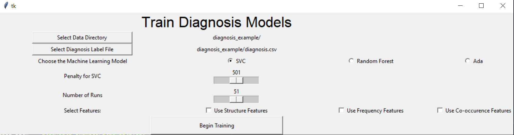
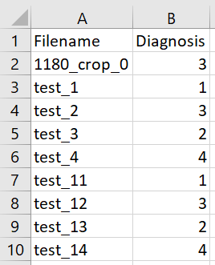

# Train Segmentation

Double click [1_train_segmentation.bat](1_train_segmentation.bat) to begin training for segmentation.

## The input images and directory organization
You should store your images and labels in a big folder, where the original
RGB images should be in the "images" folder and the labelled masks in the 
"labels" folder. Note that the filename of the image and the mask should match 
so that the computer can find the correct file. The file extension does not matter.
For instance, you can have ".jpg" format for your RGB and have ".png" format
for your labelled image.

We show our example and data below.

### Prepare your training data

The RGB images should be stored in `images` subfolder and labels should be stored in `labels` subfolder.

We recommend you to use at least 10x resolution for training the segmentation
network. 

Computers and GPUs usually could not load a big medical image into memory at once;
even if the computer could load the image, it might not have enough space to
process the image through a big convolutional neural network (CNN). Hence,
cut a big medical image into smaller pieces is usually needed, which you can 
easily performed with modern tools. We recommend to cut your medical images 
into 384x384 (width x height) images.

The supported image format is ".jpg", ".png", ".tiff", and ".tif" files. We 
recommend to use ".png" file because it uses lossless compression algorithm.

The corresponding RGB image and labelled mask should have the same size (i.e. width and height).

### Label Formats
The label should be stored as a 2D data in an image file (".png" recommended).
Each pixel in the labelled mask should correspond to the class ID of the tissue.

### Split your data into training set and validation set
You need a validation set to validate CNN model's segmentation performance.
We will randomly selected 70% images for training and the 30% rest for validation.
The image filenames for the training data will be stored in the "train.txt" file
and the validation filenames will be stored in the "val.txt" file.

## Training Process
The training process can take hours to days, depends on the size of your dataset and the 
computational power of your machine. After training, you can see a message similar to
the ones below.

Note that we only provided five example images here. So, the training process is fast and 
the  validation performance is low.

# Train Diagnosis Model

Double click [2_train_dx.bat](2_train_dx.bat) to begin training for diagnosis.

We provided an example in the [diagnosis_example/](diagnosis_example/) folder.

## Input for Training Model

### Labels: Diagnosis.csv
You need `diagnosis.csv` file with two columns: `Filename` (the image name) and `Diagnosis` (1 - 4). For the diagnosis, we use the following representation:
1. benign
2. atypia
3. DCIS
4. invasive

Here is an example of the sample `diagnosis.csv` file.

### Feature CSV Files
We store all the extracted CSV file, such as "1180_crop_0_structure_features.csv", "1180_crop_0_SuperpixelCooccurrence.csv", and "1180_crop_0_SuperpixelFrequency.csv". 

Note that the co-occurence and frequency features are computed during ROI segmentation.
The structure features will be computed before training the diagnosis classifier. If you want to compute the structure features, you can copy the outputs from ROI segmentation to the same folder. Note that extracting structure features take about 1 hour for each ROI.

## Options for Machine Learning Models
We offer the following options for machine learning models.

__Machine Learning Models__: Support Vector Machine Classifier (SVC), Random Forest (RF), Ada BoostClassifier (Ada).

__Penalty for SVC__: Regularization parameter. The strength of the regularization is inversely proportional to it.

__Number of Runs__: number of experiment runs. More runs give more stable results.

__Features__: you can select any combinations of the three set of features (structure, superpixel frequency, superpixel co-occurence). You must select at least one set of features.